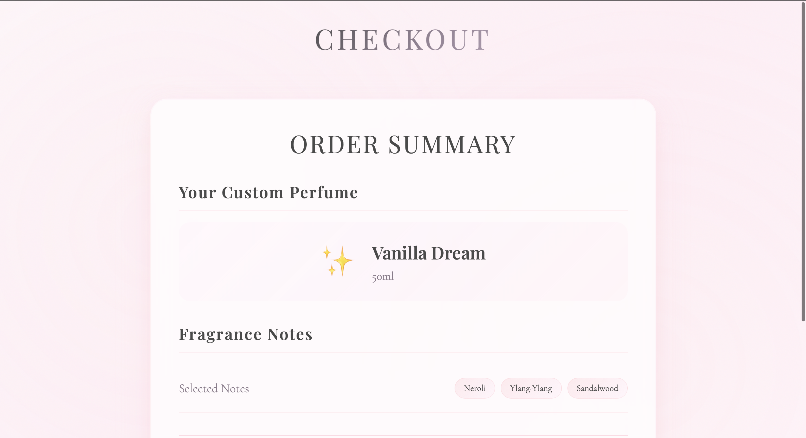
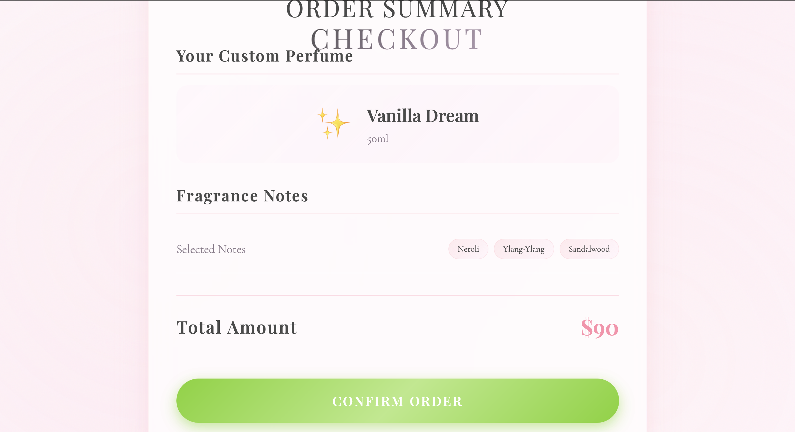
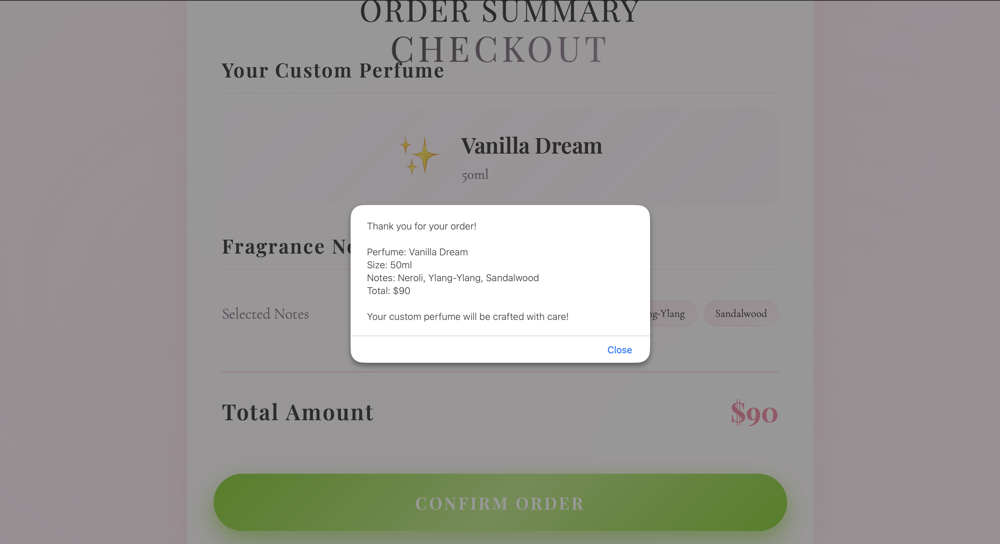

<p align="center">
  
</p>

# Scent Script 🎯
ScentScript🎯
## Basic Details

### Team Name: Pranaya's Team


### Team Members
- Member 1: Pranaya R- SCMS SCHOOL OF ENGINEERING AND TECHNOLOGY


### Hosted Project Link
https://scent-script.vercel.app/

### Project Description
ScentScript is a web application that lets users create their own custom perfume. Users can select a perfume type, choose the bottle size, pick fragrance notes,from the top notes, heart notes and base notes,review their choices in a cart before checkout. The app features a beautiful animated UI for an engaging experience.

### The Problem statement
Finding a unique, personalized fragrance is difficult with standard perfume offerings. Users want to customize scents to match their preferences.

### The Solution
ScentScript provides an interactive platform for users to design their own perfume by selecting from various types, sizes, and fragrance notes, all in a visually appealing web interface.

 Not applicable.


## Project Demo
### Video
https://drive.google.com/file/d/18BJliDX9iGej9N9lVXy1sF_C95n_HVLI/view?usp=sharing

*The video should demonstrate perfume selection, size selection, note selection, cart review, and checkout.*
## Technical Details

 No backend/API. All logic is client-side.

**For Software:**
 
- Libraries used: Google Fonts
 Not applicable.
**For Hardware:**
- Not applicable
 Not applicable.
---
- Fragrance note selection: Select top, heart, and base notes (e.g., Bergamot, Rose, Sandalwood)
- Cart and checkout: Review selections and confirm order

## AI Tools Used
**Tool Used:** GitHub Copilot
**Purpose:** UI code suggestions, CSS animation ideas, documentation
**Percentage of AI-generated code:** ~20%
**Human Contributions:** UI design, business logic, testing, documentation
- Animated UI: Floating bubbles, transitions, and interactive elements

## Team Contributions
- [Pranaya R]: UI/UX design, frontend development, documentation
---
## License
This project is licensed under the MIT License - see the [LICENSE](LICENSE) file for details.

#### Installation
```bash
[Installation commands - e.g., npm install, pip install -r requirements.txt]
```
#### Installation
No installation required. Just clone/download and open `index.html` in your browser.

#### Run
```bash
[Run commands - e.g., npm start, python app.py]
```
#### Run
Open `index.html` in your web browser.

### For Hardware:
Not applicable.

#### Components Required
Not applicable.

#### Circuit Setup
Not applicable.

---

## Project Documentation

### For Software:

#### Screenshots (Add at least 3)


*Webpage where the customer can choose the perfume essence from the given range of perfumes*


*Webpage where the customers can choose the size of the perfume*


*Webpage where the order summary is shown at the checkout*


*Webpage where a pop-up message is shown to confirm the order*

#### Diagrams

**System Architecture:**


*Explain your system architecture - components, data flow, tech stack interaction*

**Application Workflow:**


*Add caption explaining your workflow*
**System Architecture:**
Client-side web app: HTML/CSS/JS, no backend. All logic runs in browser.

**Application Workflow:**
User selects perfume → chooses size → picks notes → reviews cart → checks out.

---


---

## Additional Documentation

### For Web Projects with Backend:

#### API Documentation

**Base URL:** `https://api.yourproject.com`

##### Endpoints

**GET /api/endpoint**
- **Description:** [What it does]
- **Parameters:**
  - `param1` (string): [Description]
  - `param2` (integer): [Description]
- **Response:**
```json
{
  "status": "success",
  "data": {}
}
```

**POST /api/endpoint**
- **Description:** [What it does]
- **Request Body:**
```json
{
  "field1": "value1",
  "field2": "value2"
}
```
- **Response:**
```json
{
  "status": "success",
  "message": "Operation completed"
}
```

[Add more endpoints as needed...]

---

### For Mobile Apps:

#### App Flow Diagram


*Explain the user flow through your application*

#### Installation Guide

**For Android (APK):**
1. Download the APK from [Release Link]
2. Enable "Install from Unknown Sources" in your device settings:
   - Go to Settings > Security
   - Enable "Unknown Sources"
3. Open the downloaded APK file
4. Follow the installation prompts
5. Open the app and enjoy!

**For iOS (IPA) - TestFlight:**
1. Download TestFlight from the App Store
2. Open this TestFlight link: [Your TestFlight Link]
3. Click "Install" or "Accept"
4. Wait for the app to install
5. Open the app from your home screen

**Building from Source:**
```bash
# For Android
flutter build apk
# or
./gradlew assembleDebug

# For iOS
flutter build ios
# or
xcodebuild -workspace App.xcworkspace -scheme App -configuration Debug
```

---

### For Hardware Projects:

#### Bill of Materials (BOM)

| Component | Quantity | Specifications | Price | Link/Source |
|-----------|----------|----------------|-------|-------------|
| Arduino Uno | 1 | ATmega328P, 16MHz | ₹450 | [Link] |
| LED | 5 | Red, 5mm, 20mA | ₹5 each | [Link] |
| Resistor | 5 | 220Ω, 1/4W | ₹1 each | [Link] |
| Breadboard | 1 | 830 points | ₹100 | [Link] |
| Jumper Wires | 20 | Male-to-Male | ₹50 | [Link] |
| [Add more...] | | | | |

**Total Estimated Cost:** ₹[Amount]

#### Assembly Instructions

**Step 1: Prepare Components**
1. Gather all components listed in the BOM
2. Check component specifications
3. Prepare your workspace

*Caption: All components laid out*

**Step 2: Build the Power Supply**
1. Connect the power rails on the breadboard
2. Connect Arduino 5V to breadboard positive rail
3. Connect Arduino GND to breadboard negative rail

*Caption: Power connections completed*

**Step 3: Add Components**
1. Place LEDs on breadboard
2. Connect resistors in series with LEDs
3. Connect LED cathodes to GND
4. Connect LED anodes to Arduino digital pins (2-6)

*Caption: LED circuit assembled*

**Step 4: [Continue for all steps...]**

**Final Assembly:**

*Caption: Completed project ready for testing*

---

### For Scripts/CLI Tools:

#### Command Reference

**Basic Usage:**
```bash
python script.py [options] [arguments]
```

**Available Commands:**
- `command1 [args]` - Description of what command1 does
- `command2 [args]` - Description of what command2 does
- `command3 [args]` - Description of what command3 does

**Options:**
- `-h, --help` - Show help message and exit
- `-v, --verbose` - Enable verbose output
- `-o, --output FILE` - Specify output file path
- `-c, --config FILE` - Specify configuration file
- `--version` - Show version information

**Examples:**

```bash
# Example 1: Basic usage
python script.py input.txt

# Example 2: With verbose output
python script.py -v input.txt

# Example 3: Specify output file
python script.py -o output.txt input.txt

# Example 4: Using configuration
python script.py -c config.json --verbose input.txt
```

#### Demo Output

**Example 1: Basic Processing**

**Input:**
```
This is a sample input file
with multiple lines of text
for demonstration purposes
```

**Command:**
```bash
python script.py sample.txt
```

**Output:**
```
Processing: sample.txt
Lines processed: 3
Characters counted: 86
Status: Success
Output saved to: output.txt
```

**Example 2: Advanced Usage**

**Input:**
```json
{
  "name": "test",
  "value": 123
}
```

**Command:**
```bash
python script.py -v --format json data.json
```

**Output:**
```
[VERBOSE] Loading configuration...
[VERBOSE] Parsing JSON input...
[VERBOSE] Processing data...
{
  "status": "success",
  "processed": true,
  "result": {
    "name": "test",
    "value": 123,
    "timestamp": "2024-02-07T10:30:00"
  }
}
[VERBOSE] Operation completed in 0.23s
```

---

## Project Demo

### Video
[Add your demo video link here - YouTube, Google Drive, etc.]

*Explain what the video demonstrates - key features, user flow, technical highlights*

### Additional Demos
[Add any extra demo materials/links - Live site, APK download, online demo, etc.]

---

## AI Tools Used (Optional - For Transparency Bonus)

If you used AI tools during development, document them here for transparency:

**Tool Used:** [e.g., GitHub Copilot, v0.dev, Cursor, ChatGPT, Claude]

**Purpose:** [What you used it for]
- Example: "Generated boilerplate React components"
- Example: "Debugging assistance for async functions"
- Example: "Code review and optimization suggestions"

**Key Prompts Used:**
- "Create a REST API endpoint for user authentication"
- "Debug this async function that's causing race conditions"
- "Optimize this database query for better performance"

**Percentage of AI-generated code:** [Approximately X%]

**Human Contributions:**
- Architecture design and planning
- Custom business logic implementation
- Integration and testing
- UI/UX design decisions

*Note: Proper documentation of AI usage demonstrates transparency and earns bonus points in evaluation!*

---


Made with ❤️ at TinkerHub
